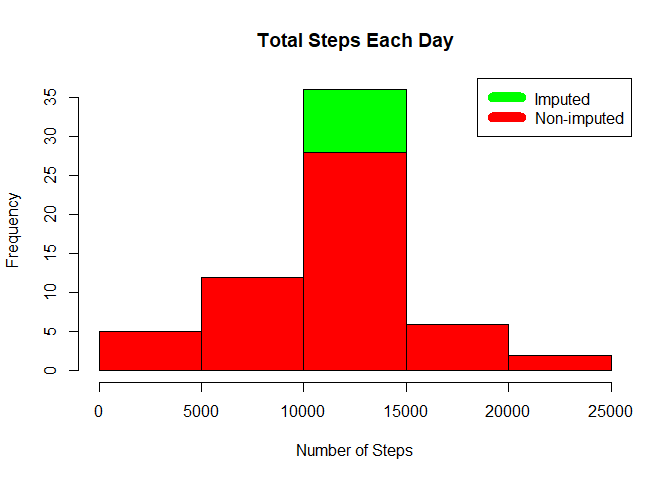

# Introduction
We use the data from a personal activity of monitoring device. This device collects data at 5 minute intervals through out the day. The data is about two months of data from an anonymous individual collected during the months of October and November, 2012 and include the number of steps taken in 5 minute intervals of each day.

## Data
steps: Number of steps taking in a 5-minute interval (missing values are coded as NA)
date: The date on which the measurement was taken in YYYY-MM-DD format
interval: Identifier for the 5-minute interval in which measurement was taken

# SUBMISSION

## Code for reading in the dataset and/or processing the data

```r
data <- read.csv("activity.csv")
```

## Histogram of the total number of steps taken each day

```r
steps_by_day <- aggregate(steps ~ date, data, sum)
hist(steps_by_day$steps, main = paste("Total Steps Each Day"), col="green", xlab="Number of Steps")
```

<!-- -->

## Mean and median number of steps taken each day

```r
steps_by_day <- aggregate(steps ~ date, data, sum)
rmean <- mean(steps_by_day$steps)
rmedian <- median(steps_by_day$steps)
sprintf("MEAN of steps taken each day = %.3f", rmean)
```

```
## [1] "MEAN of steps taken each day = 10766.189"
```

```r
sprintf("MEDIAN of steps taken each day = %.3f", rmedian)
```

```
## [1] "MEDIAN of steps taken each day = 10765.000"
```

## Time series plot of the average number of steps taken

```r
steps_by_interval <- aggregate(steps ~ interval, data, mean)
plot(steps_by_interval$interval,steps_by_interval$steps, type="l", xlab="Interval", ylab="Number of Steps",main="Average Number of Steps per Day by Interval")
```

<!-- -->

## The 5-minute interval that, on average, contains the maximum number of steps

```r
max_interval <- steps_by_interval[which.max(steps_by_interval$steps),1]
sprintf("MAXIMUM number of steps in 5-minute interval = %.0f", max_interval)
```

```
## [1] "MAXIMUM number of steps in 5-minute interval = 835"
```

## Code to describe and show a strategy for imputing missing data

```r
incomplete_data <- sum(!complete.cases(data))
sprintf("MISSING data = %.0f", incomplete_data)
```

```
## [1] "MISSING data = 2304"
```

The strategy is use the average value for that missing interval. For example, at "date"=="2012-10-01" the value 0 is NA, so the value 1.7169811 will be used as steps. This value came from the data set **steps_by_interval**.


```r
imputed_data <- transform(data, steps = ifelse(is.na(data$steps), steps_by_interval$steps[match(data$interval, steps_by_interval$interval)], data$steps))
```

## Histogram of the total number of steps taken each day after missing values are imputed

```r
imputed_steps_by_day <- aggregate(steps ~ date, imputed_data, sum)
hist(imputed_steps_by_day$steps, main = paste("Total Steps Each Day"), col="green", xlab="Number of Steps")

hist(steps_by_day$steps, main = paste("Total Steps Each Day"), col="red", xlab="Number of Steps", add=T)
legend("topright", c("Imputed", "Non-imputed"), col=c("green", "red"), lwd=10)
```

<!-- -->

### MEAN difference

```r
rmean <- mean(steps_by_day$steps)
imputed_rmean <- mean(imputed_steps_by_day$steps)
sprintf("MEAN of steps taken each day = %.3f", rmean)
```

```
## [1] "MEAN of steps taken each day = 10766.189"
```

```r
sprintf("MEAN of steps taken each day with IMPUTED data = %.3f", imputed_rmean)
```

```
## [1] "MEAN of steps taken each day with IMPUTED data = 10766.189"
```

```r
sprintf("The difference is %.3f ", imputed_rmean-rmean)
```

```
## [1] "The difference is 0.000 "
```

### MEDIAN difference

```r
rmedian <- median(steps_by_day$steps)
imputed_rmedian <- median(imputed_steps_by_day$steps)
sprintf("MEDIAN of steps taken each day = %.3f", rmedian)
```

```
## [1] "MEDIAN of steps taken each day = 10765.000"
```

```r
sprintf("MEDIAN of steps taken each day with IMPUTED data = %.3f", imputed_rmedian)
```

```
## [1] "MEDIAN of steps taken each day with IMPUTED data = 10766.189"
```

```r
sprintf("The difference is %.3f ", imputed_rmedian-rmedian)
```

```
## [1] "The difference is 1.189 "
```

### TOTAL steps difference

```r
total <- sum(steps_by_day$steps)
imputed_total <- sum(imputed_steps_by_day$steps)
sprintf("TOTAL of steps = %.3f", total)
```

```
## [1] "TOTAL of steps = 570608.000"
```

```r
sprintf("TOTAL of steps with IMPUTED data = %.3f", imputed_total)
```

```
## [1] "TOTAL of steps with IMPUTED data = 656737.509"
```

```r
sprintf("The difference is %.3f ", imputed_total-total)
```

```
## [1] "The difference is 86129.509 "
```

## Panel plot comparing the average number of steps taken per 5-minute interval across weekdays and weekends

```r
weekend_days_set <- c("Saturday", "Sunday")
imputed_data$dow = as.factor(ifelse(is.element(weekdays(as.Date(imputed_data$date)),weekend_days_set), "Weekend", "Weekday"))
imputed_steps_by_interval <- aggregate(steps ~ interval + dow, imputed_data, mean)

library(lattice)

xyplot(imputed_steps_by_interval$steps ~ imputed_steps_by_interval$interval|imputed_steps_by_interval$dow, main="Average Steps per Day by Interval",xlab="Interval", ylab="Steps",layout=c(1,2), type="l")
```

<!-- -->

